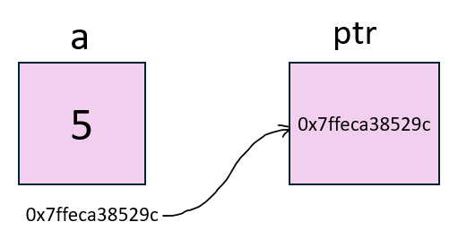
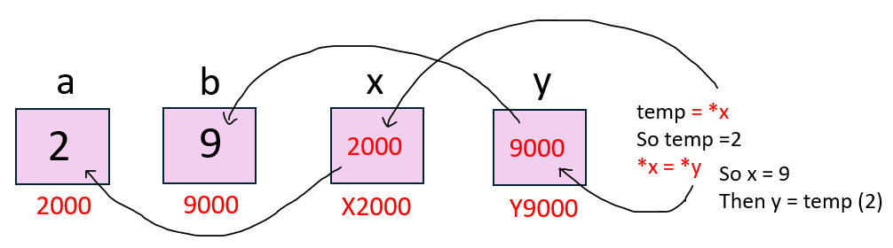
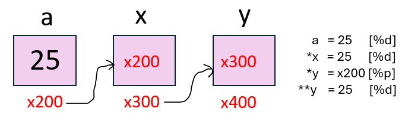

# Pointers in C
A pointer is a variable that holds the memory address of another variable.
<br>

## Printing the Value
```c
#include<stdio.h>
int main(){
  int a = 5;
  printf("%d", a);
  return 0;
}
```
```
Output: 5
```
## Printing the Address
```c
#include<stdio.h>
int main(){
  int a = 5;
  printf("%p", &a);
  return 0;
}
```
```
Output: 0x7ffef4883dd4
```
👉 `%p` is a format specifier specifically used to print memory addresses, usually represented in hexadecimal form. <br>
Note: The address that is there above will change everytime, as computer allocates a random address everytime. <br>


## Storing address 
```c
#include<stdio.h>
int main(){
  int a = 5;
  int* ptr = &a;
  printf("%p\n", &a);
  printf("%p", ptr);
  return 0;
}
```
```
Output:
0x7ffeca38529c
0x7ffeca38529c
```
👉 `int*` declares a pointer that holds the memory address of an int type variable.

<p align="center">
  <br>
  <b>Pointer Storing the address</b>
</p>
<br>

## Modifying a Value Using a Pointer
```c
#include<stdio.h> 
int main(){ 
  int a = 5; 
  int* ptr = &a; 
  *ptr = 7; 
  printf("%d", a); 
  return 0; 
}
```
```
Output: 7
```
👉 Using `*ptr`, the value at the stored address is modified, updating `a` from `5` to `7`.
<br>
<br>

## Swap 2 numbers using pointers
```c
#include<stdio.h>
void swap(int* x,int* y){
  int temp = *x;
  *x = *y;
  *y = temp;
  return;
}
int main(){
  int a = 2;
  int b = 9;
  
  swap(&a, &b);
  printf("Value of a: %d\n",a);
  printf("Value of b: %d",b);
  return 0;
}
```
```
Output:
Value of a: 9
Value of b: 2
```
<p align="center">
  <br>
  <b>Pointer Value Update Representation</b>
</p>

## Double Pointer
A double pointer in C is a pointer that stores the address of another pointer. <br>
```c
int **ptr;
```
Code on Double Pointer
```c
#include<stdio.h>
int main(){
  int a = 25;
  int* x = &a;
  int** y = &x;
  printf("%d ", a);
  printf("%d ", *x);
  printf("%d", **y);
  return 0;
}
```
```
Output: 25 25 25
```
<p align="center">
  <br>
  <b>Double Pointer representation</b>
</p>
<br>

## Modifying a Value Using Double Pointer
```c
#include<stdio.h>
int main(){
  int a = 25;
  int* x = &a;
  int** y = &x;
  printf("Initial Value of a: %d\n", a);
  **y = 30;
  printf("Modified Value of a: %d", a);
  return 0;
}
```
```
Output:
Initial Value of a: 25
Modified Value of a: 30
```
So, here `**y` will traverse back twice and modifies the value of `a` to `30`
<br>
<br>

## Sum of 2 numbers
```c
#include<stdio.h>
int sum(int* x,int* y){
  return *x + *y;
}
int main(){
  int a = 10;
  int b = 20;
  printf("%d ",sum(&a,&b));
  return 0;
}
```
```
Output: 30
```
<br>

## Sum of array of elements
```c
#include<stdio.h>
int sumOfArray(int* arr){
  int sum = 0;
  for(int i=0;i<5;i++){
    sum += *(arr + i); // same as arr[i]
  }
  return sum;
}
int main(){
  int arr[]={1,2,3,4,5};
  printf("%d", sumOfArray(arr));
  return 0;
}
```
```
Output: 15
```
<br>

## Reverse an Array
```c
#include<stdio.h>
void revArray(int n,int* arr){
  for(int i=n-1;i>=0;i--){
    printf("%d ",*(arr + i));
  }
}
int main(){
  int n;
  scanf("%d",&n);
  int arr[n];
  for(int i=0;i<n;i++){
    scanf("%d",&arr[i]);
  }
  revArray(n,arr);
  return 0;
}
```
```c
Input:           Output:
5                8 9 32 11 10
10 11 32 9 8
```
<br>

## Find Max in array
```c
#include<stdio.h>
int findMax(int *arr,int n){
  int max=*arr;
  for(int i=0;i<n;i++){
    if(max < *(arr+i)){
      max = *(arr+i);
    }
  }
  return max;
}
int main(){
  int n;
  scanf("%d",&n);
  int arr[n];
  for(int i=0;i<n;i++){
    scanf("%d",&arr[i]);
  }
  printf("%d",findMax(arr,n));
  return 0;
}
```
```c
Input:           Output:
5                40
10 11 40 9 8
```
<br>

 
